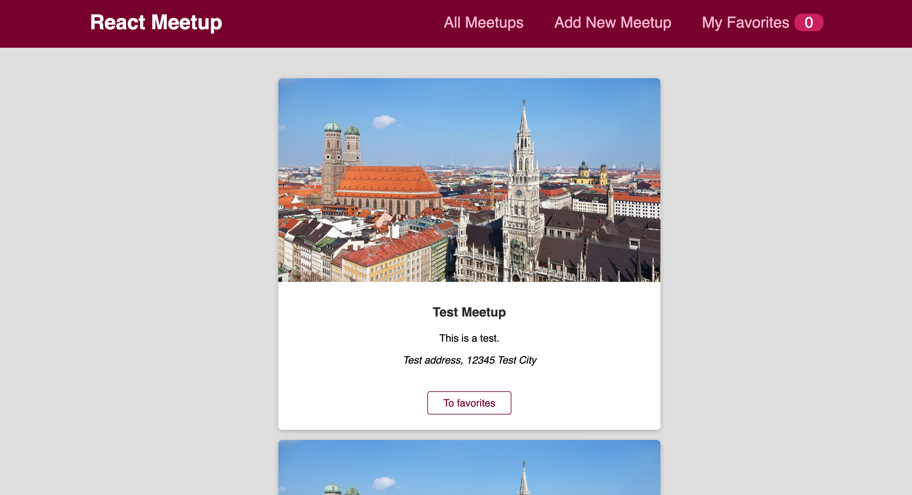

# The Jamming Project
Link to project deployed with netlify. Live demo [here](https://the-jamming-project.netlify.app)

## Table of Content
* General Information
* Technologies Used
* Features
* Screenshot
* Installation and Setup Instructions
* Usage
* Project Status
* Room for Improvement
* Acknowledgements
* Contact

## General Information
I created The Jamming Project with the intention of organizing Spotify music into playlists. You may search for your favorite artist or songs on The Jamming Project, and add them to a playlist that will directly be reflected in your Spotify app.

### Purpose of this project

To practice using API’s in this case the Spotify API.

## Technologies Used
* ReactJS - V17.0.2
* HTML
* CSS
* JavaScript

## Features
* Search for your preferred music by artist or title.
* Name your playlist.
* Submit your playlist to your Spotify application.

## Screenshot
Version 1.0 

## Installation and Setup Instructions

Clone down this repository. You will need node and `npm` installed globally on your machine.

### Installation:

`npm install`

To Run Test Suite:

`npm test`

To Start Server:

`npm start`

To Visit App:

`localhost:3000/`

## Usage

**Search**

* Search for music by title or artist.

**Add to Playlist**

* Name a playlist and add your music to it.

**Submit**

* Submit your playlist from The Jamming Project to your Spotify app.

## Project Status
Project is: Completed

## Room for Improvement
* Login authentication.
* Add tests with Jest, Enzyme, and Selenium.
* Make fetching the Client ID into a one step process, which will eliminate the need to hit the search button twice after writing the name of the song.

## Acknowledgements
* Many thanks to Codecademy.

## Contact
Created by Abeer Ahmed [LinkedIn profile](add url) - feel free to contact me.

